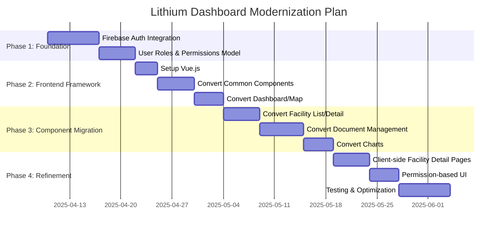

# Lithium Recycling Dashboard: Modernization Plan

This document outlines a comprehensive plan for modernizing the Lithium Recycling Dashboard application while maintaining its core functionality and leveraging existing infrastructure.

## Timeline Overview

## Current Architecture Assessment

The current application has:

1. **Frontend**: 
   - HTML, CSS, and vanilla JavaScript
   - Custom SPA implementation with client-side routing in `common.js`
   - Page-specific JavaScript files loaded dynamically
   - Server-generated HTML for facility detail pages

2. **Backend**:
   - Node.js/Express API deployed as serverless functions on Vercel
   - JWT-based authentication with hardcoded admin credentials in environment variables
   - API endpoints for facilities, documents, and file management

3. **Data Storage**:
   - Firebase Firestore for structured data (facilities, document metadata)
   - Firebase Storage for file storage
   - No user management beyond a single admin login

4. **Deployment**:
   - Vercel for hosting both frontend and backend
   - Simple configuration with API routes directed to `api/index.js`

## Feasibility Analysis of Recommendations

### ✅ Elements to Keep

#### 1. Firebase (Firestore + Storage)
**Feasibility**: High - Already implemented and working well
- Current implementation effectively uses Firestore for structured data and Storage for files
- Data model is well-designed with collections for facilities and document items
- No migration needed, just continue building on this foundation

#### 2. Vercel as Deployment Platform
**Feasibility**: High - Already implemented and working well
- `vercel.json` configuration is simple but effective
- Serverless functions are handling API requests appropriately
- Deployment process appears streamlined

#### 3. SPA with Light Routing
**Feasibility**: Medium - Implemented but could be improved
- Custom SPA implementation in `common.js` works but has some complexity
- The routing logic handles page transitions and script loading
- Keeping this approach is feasible but would benefit from refactoring

### ⚠️ Elements to Improve

#### 1. Authentication
**Feasibility**: High - Straightforward migration path
- Current implementation uses JWT with hardcoded credentials
- Firebase Auth can be integrated with minimal changes to the frontend
- Benefits include user management, multiple authentication methods, and security improvements

#### 2. JavaScript Modularization
**Feasibility**: Medium - Requires architectural changes but doable
- Current approach uses separate JS files with global functions
- Moving to Vue.js would improve organization and maintainability
- Incremental migration is possible by converting one component/page at a time

#### 3. File System Permissions
**Feasibility**: Medium - Requires data model changes
- Current document system has no user-specific permissions
- Adding a permission field to `doc_items` collection is straightforward
- UI changes would be needed to reflect and manage permissions

#### 4. Client-side Dynamic Content
**Feasibility**: Medium - Requires architectural changes
- Currently generating facility detail pages on the server
- Moving to client-side rendering would improve consistency
- Would require API endpoint changes and new frontend components

### ❌ Elements to Avoid

#### 1. Complex Custom SPA Routing
**Feasibility**: Low - Would increase technical debt
- Current routing is already complex enough
- Adding more features to the custom router would be difficult to maintain
- Better to migrate to a framework's router if more complexity is needed

#### 2. Environment Variable Authentication
**Feasibility**: Low - Security concerns
- Current approach is limited in scalability and security
- Moving to Firebase Auth is a better long-term solution

#### 3. Server-generated HTML
**Feasibility**: Low - Architectural mismatch
- Generating HTML on the server doesn't align with modern SPA architecture
- Client-side rendering is more consistent with your overall approach

## Detailed Implementation Plan

### Phase 1: Authentication & Permission Foundation

#### 1. Integrate Firebase Authentication

**Current Implementation:**
- Custom JWT authentication with hardcoded admin credentials
- No user management beyond a single admin login
- Token stored in localStorage

**Proposed Changes:**
1. Add Firebase Auth SDK to the project
2. Create authentication service to replace JWT implementation
3. Update login page to use Firebase Auth
4. Modify API endpoints to verify Firebase Auth tokens

#### 2. Implement User Roles & Permissions

**Current Implementation:**
- Single admin role with full access
- No user-specific permissions for documents

**Proposed Changes:**
1. Create a `users` collection in Firestore with role information
2. Modify `doc_items` schema to include access control fields
3. Update API endpoints to check permissions before operations

### Phase 2: Frontend Framework Integration

#### 1. Setup Vue.js

**Current Implementation:**
- Vanilla JavaScript with custom SPA routing
- Global functions and page-specific scripts
- Manual DOM manipulation

**Proposed Changes:**
1. Add Vue.js to the project (CDN for simplicity)
2. Create a basic Vue app structure while keeping existing HTML/CSS
3. Implement Vue Router to replace custom SPA routing

#### 2. Convert Common Components

**Proposed Changes:**
1. Create Vue components for header, footer, and navigation
2. Implement theme switching and auth status as Vue components
3. Keep existing CSS and Bootstrap integration

### Phase 3: Page-by-Page Migration

#### 1. Convert Dashboard/Map Page

**Proposed Changes:**
1. Create Vue component for the dashboard
2. Integrate Leaflet map as a Vue component
3. Move facility data fetching to Vue's lifecycle methods

#### 2. Convert Facility List/Detail Pages

**Proposed Changes:**
1. Create Vue components for facility list and detail views
2. Move server-generated HTML to client-side templates
3. Implement client-side rendering for facility details

#### 3. Convert Document Management

**Proposed Changes:**
1. Create Vue components for document browser
2. Implement file upload/download with Firebase Storage
3. Add permission-based UI elements

### Phase 4: Client-side Facility Detail Pages

**Current Implementation:**
- Server-generated HTML for facility detail pages
- API endpoint `/facilities/:id.html` returns full HTML

**Proposed Changes:**
1. Create a Vue component for facility details
2. Update API to return JSON data instead of HTML
3. Use client-side rendering for consistent user experience

## API Changes Required

### New API Endpoint for Related Facilities:

The API will need to be updated to support filtering facilities by company name, which will be used to display related facilities on the detail page.

## Why This Plan Is a Good Idea

1. **Incremental Migration:** The plan allows for step-by-step implementation without disrupting the existing functionality.

2. **Improved Authentication:** Firebase Auth provides better security, user management, and eliminates hardcoded credentials.

3. **Better Code Organization:** Vue.js components will make the code more maintainable and easier to understand.

4. **Enhanced User Experience:** Client-side rendering will provide a smoother, more responsive interface.

5. **Future-Proofing:** The modernized architecture will be easier to extend with new features.

6. **Leverages Existing Infrastructure:** Continues to use Firebase and Vercel, which are already working well.

7. **Reduced Technical Debt:** Replaces custom implementations with industry-standard solutions.
