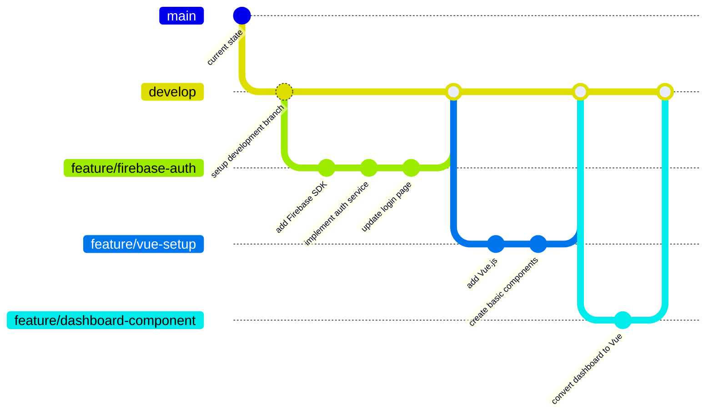

# Safe Implementation Strategy

To implement the modernization plan without risking your existing codebase, follow this step-by-step approach using Git branching and incremental changes.

## Git Branching Strategy



## Step 1: Proper Git Setup

1. **Create a development branch**
   ```bash
   git checkout -b develop
   ```

2. **Push the development branch to GitHub**
   ```bash
   git push -u origin develop
   ```

3. **Always create feature branches from develop**
   ```bash
   git checkout -b feature/[feature-name] develop
   ```

## Step 2: Create a Local Testing Environment

1. **Clone your repository to a separate folder for testing**
   ```bash
   git clone [your-repo-url] lithium-dashboard-test
   cd lithium-dashboard-test
   git checkout develop
   ```

2. **Set up a separate Firebase project for testing**
   - Create a new Firebase project in the Firebase console
   - Update configuration to point to this test project
   - This ensures your production data remains untouched

## Step 3: Implement Changes Incrementally

### Phase 1: Firebase Auth (Parallel Implementation)

Instead of replacing your current authentication immediately:

1. **Add Firebase Auth alongside existing JWT auth**
   ```bash
   git checkout -b feature/firebase-auth develop
   # Make changes...
   ```

2. **Create a toggle in your environment variables**
   ```
   USE_FIREBASE_AUTH=false
   ```

3. **Implement conditional authentication logic**
   ```javascript
   // Example pseudocode
   if (process.env.USE_FIREBASE_AUTH === 'true') {
     // Use Firebase Auth
   } else {
     // Use existing JWT auth
   }
   ```

4. **Test thoroughly in your test environment**

5. **Merge to develop when ready**
   ```bash
   git checkout develop
   git merge feature/firebase-auth
   git push origin develop
   ```

### Phase 2: Vue.js Integration (Progressive Enhancement)

1. **Start with non-critical pages**
   ```bash
   git checkout -b feature/vue-about-page develop
   # Convert about page to Vue...
   ```

2. **Use Vue for new features first**
   - Any new features should be built with Vue
   - Existing features can be migrated gradually

3. **Create hybrid pages that work with both systems**
   - Pages can detect if Vue is available and use it
   - Fallback to vanilla JS if not

## Step 4: Deployment Strategy

### Option 1: Preview Deployments

Use Vercel's preview deployments to test changes before they go live:

1. **Configure Vercel to create preview deployments for all branches**
2. **Share preview URLs with stakeholders for feedback**
3. **Only merge to main when everything is validated**

### Option 2: Feature Flags

Implement feature flags to control which users see new features:

```javascript
// Example feature flag implementation
const FEATURES = {
  useVueComponents: false,
  useFirebaseAuth: false,
  useClientSideRendering: false
};

// In your code
if (FEATURES.useVueComponents) {
  // Use Vue components
} else {
  // Use existing implementation
}
```

### Option 3: Parallel Deployment

1. **Deploy the modernized version to a separate subdomain**
   - e.g., `new.your-domain.com`

2. **Allow users to opt-in to the new version**

3. **Gather feedback and fix issues before full migration**

## Step 5: Rollback Plan

Always have a rollback plan ready:

1. **Document the current state before major changes**
   ```bash
   git tag v1.0.0-pre-modernization
   git push origin v1.0.0-pre-modernization
   ```

2. **Create restore scripts if needed**
   - Backup your Firestore data
   - Document the steps to restore to the previous state

3. **Know how to quickly revert in production**
   ```bash
   # If needed, revert to the pre-modernization state
   git checkout v1.0.0-pre-modernization
   git checkout -b hotfix/revert-to-stable
   git push -u origin hotfix/revert-to-stable
   # Deploy this branch
   ```

## Step 6: Phased Rollout Timeline

| Phase | Description | Timeline | Rollback Window |
|-------|-------------|----------|-----------------|
| 1 | Firebase Auth (parallel) | 2 weeks | 1-2 days |
| 2 | Vue.js Core Setup | 1 week | 1 day |
| 3 | First Vue Component | 1 week | 1 day |
| 4 | Additional Components | 2-3 weeks | 1 day per component |
| 5 | Full Cutover | 1 week | Keep old system for 2 weeks |

By following this approach, you'll minimize risk while still making progress toward modernizing your application.