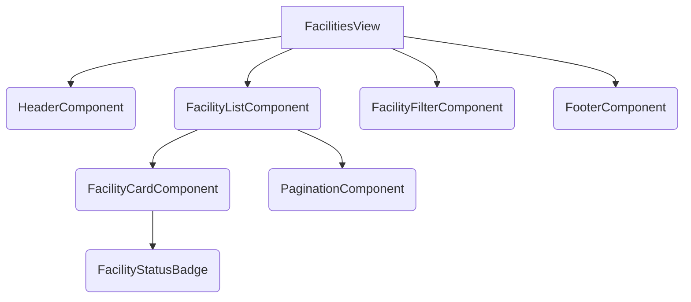
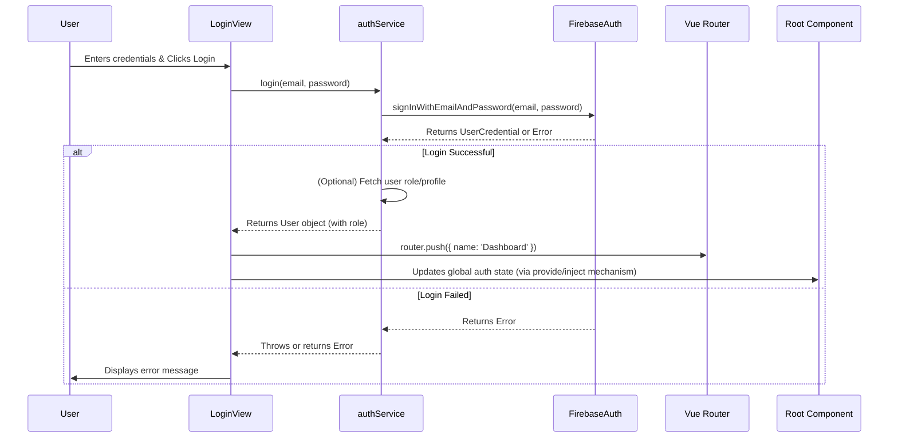

# Vue.js Application Architecture

## 1. Introduction

This document provides a comprehensive overview of the modernized architecture for the Lithium Recycling Dashboard project. The project has been migrated to use **Vue 3** with the **Composition API** and **Vite** as the build tool, replacing the previous vanilla JavaScript and static HTML structure.

The primary goal of this documentation is to serve as a guide for developers, especially those new to the project, enabling them to understand the structure, patterns, and best practices for contributing effectively.

## 2. Core Technologies

The modernized frontend relies on the following core technologies:

*   **Vite:** A fast frontend build tool providing quick server start and Hot Module Replacement (HMR).
*   **Vue 3:** The progressive JavaScript framework. We utilize the **Composition API** for better code organization and reusability.
*   **Vue Router:** Handles client-side routing within the single-page application (SPA).
*   **Pinia:** State management library for Vue.js, used for managing complex feature-specific state. (Note: Basic global state like authentication is handled via Vue's `provide`/`inject`).
*   **Firebase:** Backend-as-a-Service platform used for:
    *   **Authentication:** User login/logout.
    *   **Firestore:** NoSQL database for storing application data (facilities, documents, etc.).
    *   **(Potentially) Cloud Functions:** For server-side logic (if applicable).
*   **Chart.js:** Library for creating data visualizations (charts).
*   **Leaflet:** Library for interactive maps, used with `leaflet.markercluster` for handling numerous map markers.
*   **Custom Components:** UI elements are primarily custom-built Vue components.

## 3. Project Structure

The core frontend code resides within the `src/` directory. Here's a breakdown of the key directories and files:

```
lithium-recycling-dashboard/
├── public/             # Static assets copied directly to build output (favicon, etc.)
├── src/                # Main application source code
│   ├── assets/         # Static assets processed by Vite (images, CSS - if not global)
│   ├── components/     # Reusable Vue components (e.g., buttons, badges, cards)
│   ├── services/       # Modules for interacting with external APIs/Firebase
│   ├── stores/         # Pinia state management stores
│   ├── views/          # Top-level page components (routed components)
│   ├── firebase-config.js # Firebase initialization and configuration
│   └── main.js         # Main application entry point (Vue app creation, router setup)
├── index.html          # Main HTML entry point for the SPA (Vite injects scripts here)
├── package.json        # Project dependencies and scripts
├── vite.config.js      # Vite configuration file
├── firebase.json       # Firebase hosting/emulator configuration
├── firestore.rules     # Firestore security rules
├── vercel.json         # Vercel deployment configuration (if used)
└── docs/               # Project documentation (like this file)
    └── vue-architecture.md
```

*   **`public/`:** Assets here are served directly from the root and are not processed by Vite. Suitable for favicons, robots.txt, etc.
*   **`src/`:** Contains all the Vue application code.
    *   **`assets/`:** Static assets like images or global CSS that should be processed by Vite (e.g., hashing for cache busting).
    *   **`components/`:** Small, reusable UI building blocks (e.g., `FacilityStatusBadge.vue`). Should be generic and stateless where possible.
    *   **`services/`:** Handles all external communication, primarily with Firebase (Auth, Firestore). Encapsulates data fetching and manipulation logic.
    *   **`stores/`:** Pinia stores for managing shared, complex state related to specific application features (e.g., `facilityStore.js`, `documentStore.js`).
    *   **`views/`:** Represent distinct pages or sections of the application. These are the components mapped directly to routes in the router configuration. They often compose multiple smaller components.
    *   **`firebase-config.js`:** Initializes the Firebase SDK.
    *   **`main.js`:** The heart of the application initialization. It creates the Vue app instance, sets up Vue Router, initializes basic global state (`provide`/`inject`), and mounts the application to the DOM (`#app` in `index.html`).
*   **`index.html`:** The single HTML file shell for the SPA. Vite automatically injects the necessary script tags during development and build.
*   **Legacy Files:** Note that some `.html` files might exist within `src/views/` (e.g., `about.html`). These appear to be remnants of the previous structure and are **not** used by the Vue Router in the modernized application. Views are now exclusively `.vue` files.

## 4. Architecture Deep Dive

### 4.1. Views (`src/views/`)

*   **Role:** Top-level components representing application pages (e.g., Dashboard, Facilities List, Facility Detail).
*   **Routing:** Each `.vue` file in `views/` typically corresponds to a route defined in `src/main.js`.
*   **Composition:** Views orchestrate the page layout by importing and arranging multiple `components/`. They often interact with `stores/` to get data and `services/` (sometimes indirectly via stores) to trigger actions.

### 4.2. Components (`src/components/`)

*   **Role:** Reusable UI pieces (buttons, forms, cards, badges, etc.).
*   **Design:** Aim for components to be:
    *   **Focused:** Do one thing well.
    *   **Reusable:** Avoid coupling to specific views or data structures where possible.
    *   **Stateless (Preferably):** Receive data via props and emit events for user interactions (`props down, events up`). Local UI state (e.g., dropdown open/closed) is acceptable.
*   **Naming:** Use PascalCase (e.g., `FacilityStatusBadge.vue`).
*   **Location:** Place components directly in `src/components/`. Subdirectories can be used for organization if the number of components grows significantly (e.g., `src/components/forms/`).

### 4.3. Routing (`src/main.js` & Vue Router)

*   **Configuration:** Defined in `src/main.js` using `vue-router`.
*   **Mode:** Uses `createWebHistory()` for clean URLs without hashbangs (`#`). Requires server-side configuration to handle page reloads by always serving `index.html`.
*   **Routes:** An array of route objects maps URL paths to View components.
*   **Dynamic Segments & Props:** Routes can have dynamic segments (e.g., `/facilities/:id`). Setting `props: true` in the route definition allows the segment (e.g., `id`) to be passed directly as a prop to the View component.
*   **Navigation Guards:** `router.beforeEach` in `main.js` is currently used for logging navigation. It could be extended for authentication checks, although the primary auth check currently happens in the root component's `setup` function.

### 4.4. State Management

This application uses a hybrid approach:

*   **Global State (`provide`/`inject` in `main.js`):**
    *   **Usage:** For simple, relatively stable global state like authentication status (`isAuthenticated`, `currentUser`, `userRole`) and theme preference (`theme`).
    *   **Mechanism:** State is defined as `ref`s in the root component's `setup` function (`main.js`) and provided to the entire application using `provide`. Descendant components use `inject` to access this state.
    *   **Immutability:** State provided is wrapped in `readonly()` to prevent accidental modification by child components. Updates are handled by methods also provided from the root (e.g., `handleLogout`, `toggleTheme`).
*   **Feature State (Pinia in `src/stores/`):**
    *   **Usage:** For more complex, feature-specific state that might be accessed or modified by multiple components within that feature (e.g., list of facilities, document tree, loading states, filters).
    *   **Mechanism:** Pinia stores (`defineStore`) are defined in `src/stores/`. They typically contain:
        *   `state`: Reactive data properties.
        *   `getters`: Computed properties derived from state.
        *   `actions`: Methods to update state, often involving asynchronous calls to services.
    *   **Access:** Components import and use the specific store they need (e.g., `import { useFacilityStore } from '@/stores/facilityStore'; const facilityStore = useFacilityStore();`).

### 4.5. Services (`src/services/`)

*   **Role:** Abstract away the details of external interactions. This keeps components and stores cleaner and makes mocking for tests easier.
*   **Responsibilities:**
    *   Making API calls (if any external APIs besides Firebase are used).
    *   Interacting with Firebase services (Auth, Firestore).
    *   Handling data transformation between the external source format and the application's internal format if necessary.
*   **Examples:**
    *   `authService.js`: Handles login, logout, user status checks via Firebase Auth.
    *   `facilities.js`: Handles fetching, adding, updating, deleting facility data from Firestore.
    *   `documents.js`: Handles fetching and potentially managing document data/metadata from Firestore or Storage.
*   **Usage:** Services are typically imported and used within Pinia store actions or sometimes directly within component `setup` functions for simple cases (though using stores is generally preferred for stateful operations).

### 4.6. Firebase Integration

*   **Configuration:** Initialized in `src/firebase-config.js` using credentials/configuration (ensure sensitive keys are handled appropriately, e.g., via environment variables).
*   **Services Used:**
    *   **Authentication:** Managed via `authService.js`.
    *   **Firestore:** Primary database, accessed via services like `facilities.js` and `documents.js`. Data modeling should follow Firestore best practices.
*   **Security:** Firestore security rules (`firestore.rules`) are crucial for controlling data access based on user authentication and roles.

## 5. Diagrams (Mermaid)

### 5.1. Component Hierarchy Example



*Diagram showing `FacilitiesView` composing several child components.*

### 5.2. Data Flow (Pinia Example)

```mermaid
graph LR
    subgraph Browser
        direction TB
        A[User Action (e.g., Click Filter)] --> B(Component: FacilityFilter);
        B -- Emits Event --> C(View: FacilitiesView);
        C -- Calls Action --> D(Pinia Store: facilityStore);
        D -- Updates State --> D;
        subgraph Reactive Update
            D -- State Change --> E(View: FacilitiesView);
            E -- Reads State/Getter --> E;
            E -- Passes Props --> F(Component: FacilityList);
            F -- Reads State/Getter --> F;
        end
    end

    subgraph Backend/Services
        direction TB
        D -- Calls Service --> G(Service: facilities.js);
        G -- Interacts With --> H(Firebase Firestore);
        H -- Returns Data --> G;
        G -- Returns Data --> D;
    end

    style Reactive Update fill:#f9f,stroke:#333,stroke-width:2px
```

*Diagram illustrating data flow from user interaction through components, views, Pinia store, services, and back for reactive updates.*

### 5.3. Request Flow (Login Example)



*Diagram showing the sequence of events during a user login attempt.*

## 6. Best Practices & Contributing

### 6.1. Adding a New Feature (e.g., "Suppliers" Page)

1.  **View:** Create `src/views/SuppliersView.vue`.
2.  **Route:** Add a new route object in `src/main.js`:
    ```javascript
    { path: '/suppliers', component: SuppliersView, name: 'SuppliersList' /*, meta: { requiresAuth: true } */ }
    ```
3.  **Components:** Create necessary reusable components in `src/components/` (e.g., `SupplierCard.vue`, `SupplierFilter.vue`).
4.  **Service:** Create `src/services/suppliers.js` to handle fetching/managing supplier data from Firestore.
5.  **Store:** If state is complex (list, filters, loading status), create `src/stores/supplierStore.js` using Pinia. Import and use the `suppliers.js` service within the store's actions.
6.  **Implementation:** Build the `SuppliersView.vue`, importing components, using the `supplierStore` (or service directly if state is simple), and arranging the layout.
7.  **Navigation:** Add links to the new page in appropriate places (e.g., `HeaderComponent.vue`).
8.  **Testing:** Write unit tests for new components, stores, and potentially services using Vitest and Vue Test Utils.

### 6.2. Coding Style

*   Follow standard Vue.js style guides.
*   Utilize linters and formatters if configured (e.g., ESLint, Prettier) to maintain consistency.
*   Use the Composition API (`<script setup>`) for new components.
*   Keep components focused and reusable.

### 6.3. State Management Choices

*   **Local Component State (`ref`, `reactive`):** Use for state tightly coupled to a single component's UI (e.g., is a modal open, current input value).
*   **`provide`/`inject` (Root `main.js`):** Suitable for truly global, relatively stable state like authentication status or theme, where updates are controlled centrally.
*   **Pinia Stores (`src/stores/`):** Preferred for managing shared state related to specific application features (facilities, documents, suppliers). Use when multiple components need to react to or modify the same state, or when state logic becomes complex (involving async actions, multiple mutations).

### 6.4. API Interaction

*   **Always use the Services layer (`src/services/`)** for any interaction with external resources (Firebase, other APIs).
*   Components and Views should ideally interact with Pinia stores, which in turn call services. Direct service calls from components are acceptable for very simple, non-stateful operations, but stores are generally preferred.

## 7. Build & Deployment

*   **Development:** Run `npm run dev` to start the Vite development server with HMR.
*   **Build:** Run `npm run build` to create a production-ready build in the `dist/` directory.
*   **Preview:** Run `npm run preview` to serve the production build locally for testing.
*   **Deployment:** Refer to `firebase.json` for Firebase Hosting configuration and `vercel.json` if Vercel is used. Deployment typically involves building the application and deploying the contents of the `dist/` directory. Ensure server rewrite rules are configured correctly for `createWebHistory` mode (directing all paths to `index.html`).